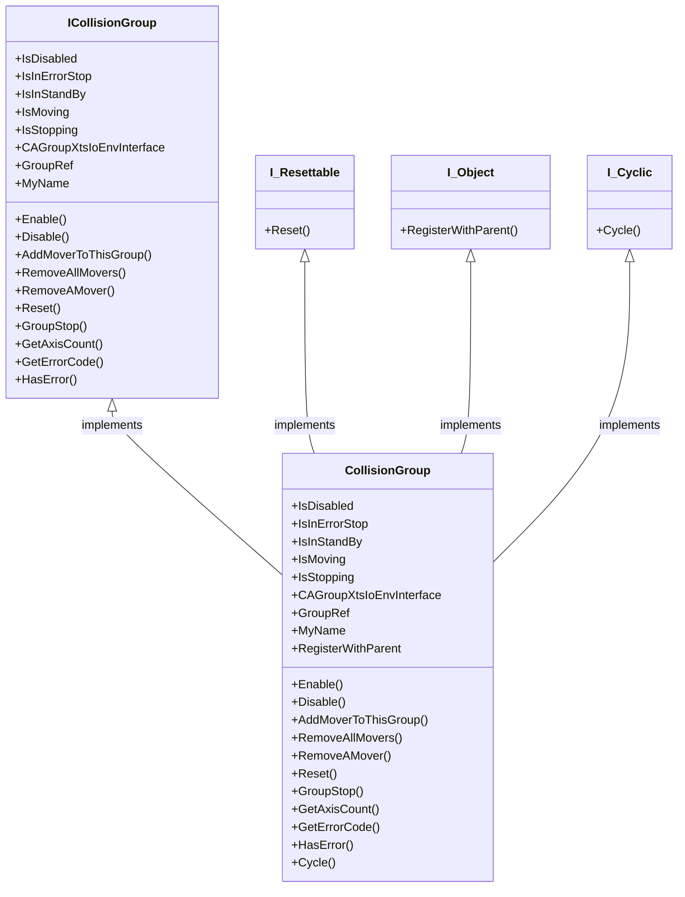

# Collision Group Class

## Class Diagram

```mermaid

classDiagram
    class CollisionGroup{
        +Enable()
        +Disable()
        +AddMoverToThisGroup()
        +RemoveAllMovers()
        +RemoveAMover()
        +Reset()
        +GroupStop()
        +GetAxisCount()
        +GetErrorCode()
        +HasError()
        +IsDisabled
        +IsInErrorStop
        +IsInStandBy
        +IsMoving
        +IsStopping
        +CAGroupXtsIoEnvInterface
        +Cycle()
        +GroupRef
        +MyName
        +RegisterWithParent
    }

    class ICollisionGroup{
        +Enable()
        +Disable()
        +AddMoverToThisGroup()
        +RemoveAllMovers()
        +RemoveAMover()
        +Reset()
        +GroupStop()
        +GetAxisCount()
        +GetErrorCode()
        +HasError()
        +IsDisabled
        +IsInErrorStop
        +IsInStandBy
        +IsMoving
        +IsStopping
        +CAGroupXtsIoEnvInterface
        +GroupRef
        +MyName
    }

    class I_Cyclic{
        +Cycle()
    }

    class I_Resettable{
        +Reset()
    }
    class I_Object{
        +RegisterWithParent()
    }

    ICollisionGroup <|-- CollisionGroup : implements
    I_Resettable <|-- CollisionGroup : implements
    I_Object <|-- CollisionGroup : implements
    I_Cyclic <|-- CollisionGroup : implements
```