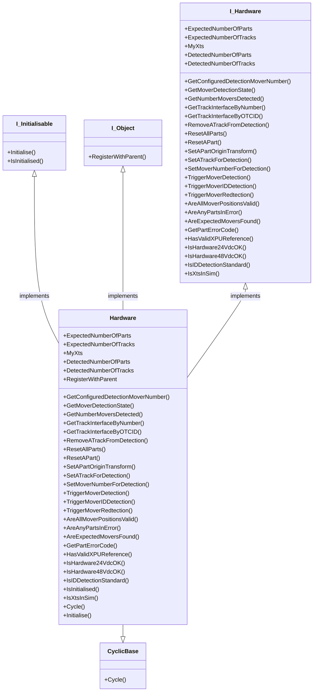

# Hardware Class

The module class is the basic element of any XTS system, this class is its software representation. The module uses its XtsIoEnv interfaceto pull data about each module direct from the XPU. The main function of the class is to monitor the module for issues in its electrical system. Higher level errors are pushed into the movers, part and tracks.

## Class Diagram

## Interface
### GetConfiguredDetectionMoverNumber()
### GetMoverDetectionState()
### GetNumberMoversDetected()
### GetTrackInterfaceByNumber()
### GetTrackInterfaceByOTCID()
### RemoveATrackFromDetection()
### ResetAllParts()
### ResetAPart()
### SetAPartOriginTransform()
### SetATrackForDetection()
### SetMoverNumberForDetection()
### TriggerMoverDetection()
### TriggerMoverIDDetection()
### TriggerMoverRedtection()
### ExpectedNumberOfParts
### ExpectedNumberOfTracks
### MyXts
### AreAllMoverPositionsValid()
### AreAnyPartsInError()
### AreExpectedMoversFound()
### DetectedNumberOfParts
### DetectedNumberOfTracks
### GetPartErrorCode()
### HasValidXPUReference()
### IsHardware24VdcOK()
### IsHardware48VdcOK()
### IsIDDetectionStandard()
### IsXtsInSim()