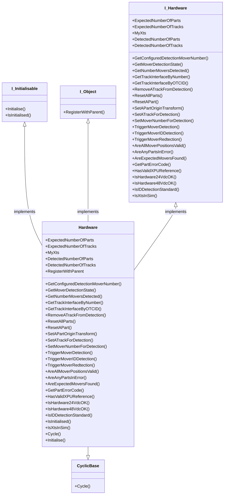

# Hardware Class

The module class is the basic element of any XTS system, this class is its software representation. The module uses its XtsIoEnv interfaceto pull data about each module direct from the XPU. The main function of the class is to monitor the module for issues in its electrical system. Higher level errors are pushed into the movers, part and tracks.

## Class Diagram

## Interface

### GetConfiguredDetectionMoverNumber()

Returns the mover detection number configured in the XPU (configured value not the found movers)

### GetMoverDetectionState()

Returns the detection state of the XTS XPU, can be used to monitor search process.

### GetNumberMoversDetected()

Returns the detexted mover count from the XPU

### GetTrackInterfaceByNumber(TrackNumber : UINT)

Returns an interface (assuming it exists) for the requested track

### GetTrackInterfaceByOTCID(TrackOCTID : OTCID)

Returns an interface (assuming it exists) for the track with OTCID arguement

### RemoveATrackFromDetection(TrackToRemove : UINT)

Assuming track exists it triggers its remove from detection function

### ResetAllParts()

Issues reset command to all parts in hardware

### ResetAPart(Part : UINT)

Issues reset command to part in arguement

### SetAPartOriginTransform(Part : INT, OriginTransform: Tc3_XTS_Utility.ST_OriginTransform)

Sets a coordinate transform to the part passed as arguement (used for sim work to allow motion on the xts hmi)

### SetATrackForDetection(TrackToDetect : UINT;)

Assuming TrackToDetect exists, it issues the command to set it for detection.

### SetMoverNumberForDetection(NumberOfMovers : INT)

Sets the configured movers for detection to the arguement, blocks too many.

### TriggerMoverDetection()

Triggers a mover detection on XPU

### TriggerMoverIDDetection()

Triggers a mover 1 detection on XPU

### TriggerMoverRedtection()

Triggers a full redetection, all modules in XPU affected, will stop all motion

### ExpectedNumberOfParts

Get/Sets the expected number of parts, used on declaration

### ExpectedNumberOfTracks

Get/Sets the expoected number of tracks, used on declaration

### MyXts

Get/Sets the XTS XPU interface this hardware is registered to

### AreAllMoverPositionsValid()

Returns TRUE is all movers return valid positions 

### AreAnyPartsInError()

Returns a TRUE if ANY part is in error

### AreExpectedMoversFound()

Returns a TRUE if the expected and configured mover count is the same

### DetectedNumberOfParts

Returns the detected part number from XPU

### DetectedNumberOfTracks

Returns the detected track number from XPU

### GetPartErrorCode()

Returns the highest priority error code from all parts

### HasValidXPUReference()

Returns TRUE is XPU reference is valid

### IsHardware24VdcOK()

Returns FAILED HRESULT if any part falls below 24vdc

### IsHardware48VdcOK()

Returns FAILED HRESULT if any part falls below 48vdc

### IsIDDetectionStandard()

Returns TRUE is detection is set to standard detection

### IsXtsInSim()

Returns TRUE if XPU set in simulation mode