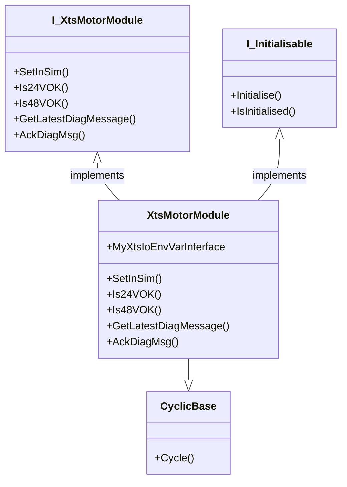

# XtsMotorModule Class

## Overview

The module class is the basic element of any XTS system, this class is its software representation. The module uses its XtsIoEnv interfaceto pull data about each module direct from the XPU. The main function of the class is to monitor the module for issues in its electrical system. Higher level errors are pushed into the movers, part and tracks.

## Class Diagram



## Implements

Inside the Part class is the following:
```
_MyModuleIoInterface : I_TcIoXtsPartModule;
```
This interface is populated in the initialise phase of the [Part](./Part%20Class.md). It is via this function that the Module Class class can perform tasks listed below. 

### Cycle

### Initialise

## Interface

### SetInSim()

This method is used by the part class to set the module into sim mode, this detection is done at the [Hardware Class](./Hardware%20Class.md) level and passed down to the module through the parent part.

### Is24VOK()

This method returns a TRUE value if the module has 24Vdc +-20%, this is the rated values, however practically the voltage should never vary that much and steps should be taken if the voltage is outside +-2%.

### Is48VOK()

This method returns a TRUE value if the module has 48Vdc +-10%, this is the rated values, however practically the voltage should never vary that much and steps should be taken if the voltage is outside +-2%. This will affect the system as this provides the motive power to the movers.

### GetLatestDiagMessage()

The module cyclic reads the diagnostic messages if availble, this method then returns the first available message. 

### AckDiagMsg()

This method allows the user to acknowledge any diagnostics messages, to stop them being resent to the controller.