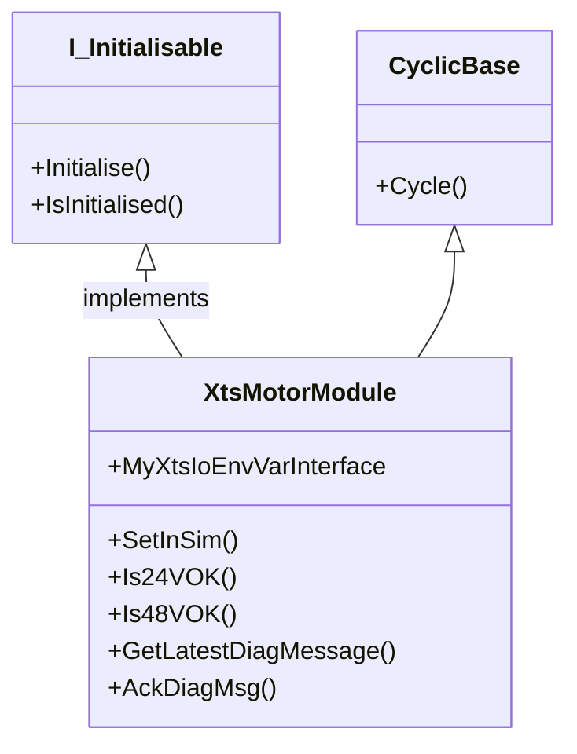

# XtsMotorModule Class

## Class Diagram

```mermaid

classDiagram
    class XtsMotorModule{
        +SetInSim()
        +Is24VOK()
        +Is48VOK()
        +GetLatestDiagMessage()
        +AckDiagMsg()
        +MyXtsIoEnvVarInterface
    }

    class CyclicBase{
        +Cycle()
    }

    class I_Initialisable{
        +Initialise()
        +IsInitialised()
    }

    I_Initialisable <|-- XtsMotorModule : implements
    CyclicBase <|-- XtsMotorModule
```