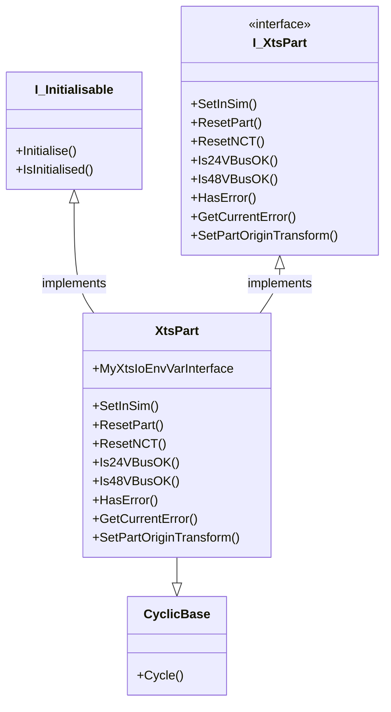
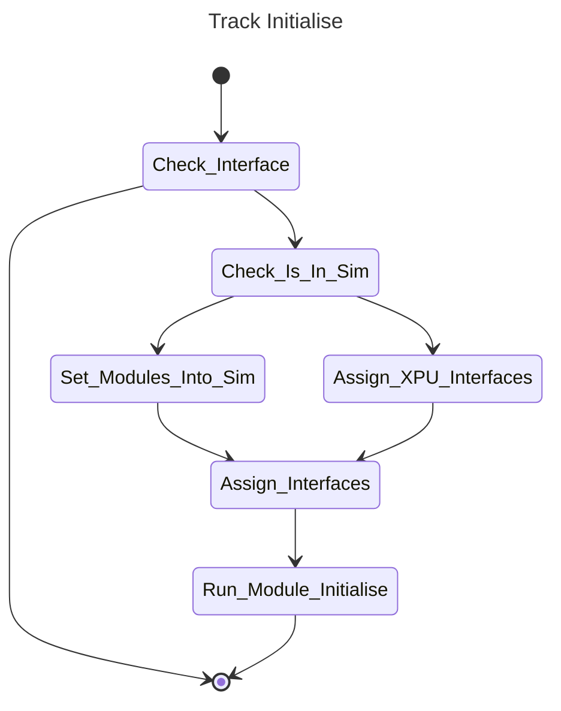

# Part Class

## Overview

The Part class represents a group of motor modules, it is the governor for them, bringing together diagnostic and control data for all modules included in its set up. This class represents that function, allowing resetting and status checks on the modules within.

## Class Diagram



## Implementation

Inside the Part class is the following:
```
_MyInterface : Tc3_XTS_Utility.I_TcIoXtsXpuPart;
```
This interface is populated in the initialise phase of the [hardware](Hardware%20Class.md). It is via this function that the Part class can perform tasks listed below. 

### Cycle

The cycle method is relatively simple, it basically performs 2 funcitons:

1. It cyclically calls the cycle methods of its modules contained in the MyModules array.
2. It cyclically checks the status of the drive (part) and the voltage, it also loops through the MyModules array and takes the highest priority diagnostics message should there be any.

### Initialise

The initialise method sets up the Part class, there is not a lot ot set up here, but it follows this state machine:



## Interface

### SetInSim()

This method is invoked by the [Hardware Class](./Hardware%20Class.md) during its initialisation, its simply sets the part into simulation mode, which in turns calls the internal modules.

### ResetPart()

This method thriggers the part reset function, this allows the clearing of module faults and part faults without needing the movers, not typically needed as the movers forward reset commands.

### ResetNCT()

Triggers a reset of the NCT element of a module.

### Is24VBusOK()

This method returns a TRUE if all modules in part report a good 24vdc 

### Is48VBusOK()

This method returns a TRUE if all modules in part report a good 48Vdc.

### HasError()

This method returns a TRUE if the module goes into Fault, FaultReactionActive or DCLinkVoltage not ready.

### GetCurrentError()

This method returns the current error value from the part.

### SetPartOriginTransform()

This method allows you to set x and y coordinates for the part as displayed in TcHMI, this is useful for TMS applications representing modules on switches.