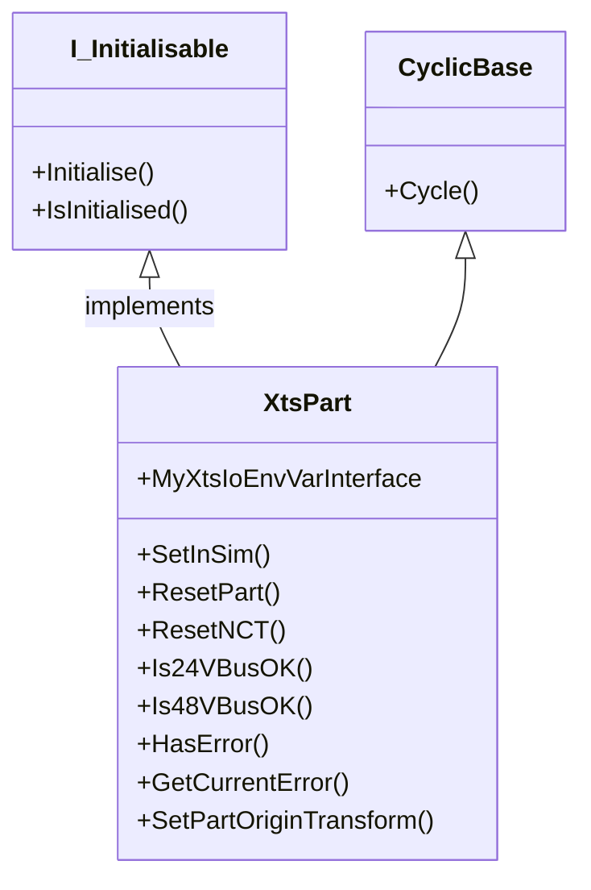

# Part Class

## Class Diagram

```mermaid

classDiagram
    class XtsPart{
        +SetInSim()
        +ResetPart()
        +ResetNCT()
        +Is24VBusOK()
        +Is48VBusOK()
        +HasError()
        +GetCurrentError()
        +SetPartOriginTransform()
        +MyXtsIoEnvVarInterface
    }

    class CyclicBase{
        +Cycle()
    }

    class I_Initialisable{
        +Initialise()
        +IsInitialised()
    }

    I_Initialisable <|-- XtsPart : implements
    CyclicBase <|-- XtsPart
```