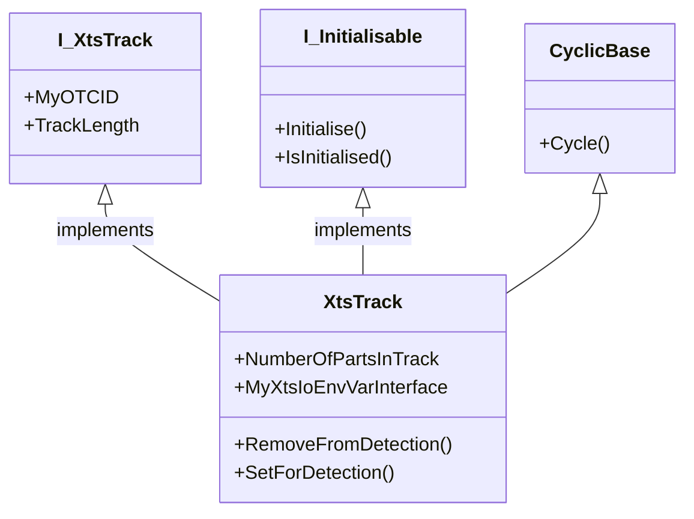

# Track Class

## Class Diagram

```mermaid

classDiagram
    class XtsTrack{
        +RemoveFromDetection()
        +SetForDetection()
        +NumberOfPartsInTrack
        +MyXtsIoEnvVarInterface
    }

    class I_XtsTrack{
       +MyOTCID
       +TrackLength
    }

    class CyclicBase{
        +Cycle()
    }

    class I_Initialisable{
        +Initialise()
        +IsInitialised()
    }

    I_XtsTrack <|-- XtsTrack : implements
    I_Initialisable <|-- XtsTrack : implements
    CyclicBase <|-- XtsTrack
```