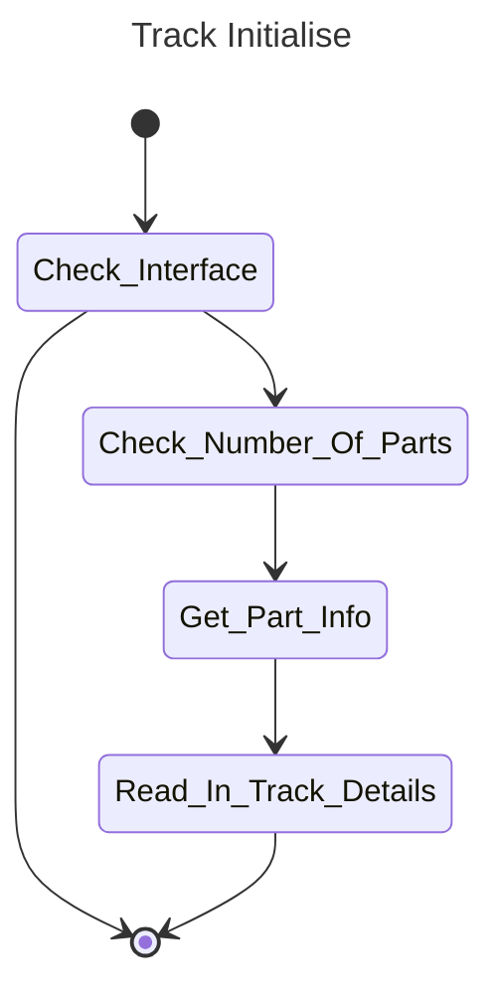

# Track Class

## Overview

The Track class represents a group of parts, it is the governor for them, bringing together diagnostic and control data for all Parts included in its set up. This class represents that function, allowing resetting and status checks on the parts within.


## Class Diagram


## Implementation

Inside the Part class is the following:
```
_MyInterface : I_TcIoXtsXpuTrack;
```
This interface is populated in the initialise phase of the [hardware](Hardware%20Class.md). It is via this function that the Track class can perform tasks listed below. 

### Cycle

The cyclic method simply checks cyclic maintainence parameters, in the current case this is simply the check on track being in detection or not.

### Initialise

The initialise method sets up the track class, there is not a lot ot set up here, but it follows this state machine:



## Interface

### RemoveFromDetection()

Returns a TRUE if the track successfully calls the SetIsIncludedInDetection(FALSE) command

### SetForDetection()

Returns a TRUE if the track successfully calls the SetIsIncludedInDetection(TRUE) command

### NumberOfPartsInTrack

Returns the number of detected parts in track

### TrackLength

Returns the configured length of the track