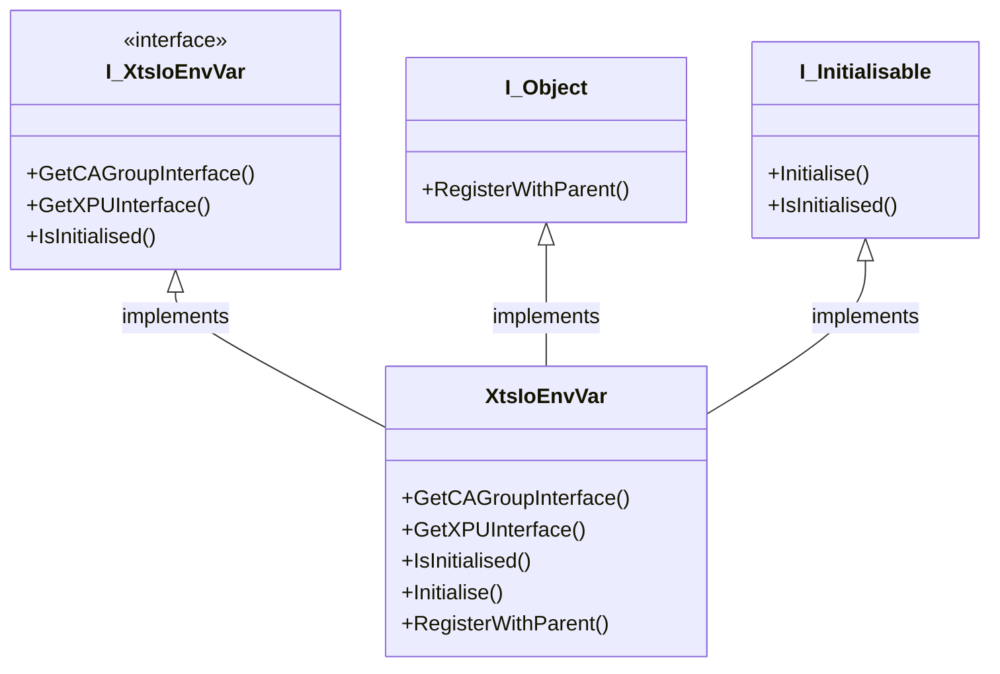

# XtsIoEnvVar Class

## Overview

The XtsIoEnvVar is a wrapper class, its is not required, however it protects the user of the framework from changes in the implementation detail of the XTS drivers and the XPU. It is now a very stable product, but there is still development and changes, this calls is put in place to act as a channel through which the framework accesses the XPU. It is responsible for finding the relevant interfaces and passing them to the classes that use them, for example the 

## Class Diagram



## Implementation

Inside the Part class is the following:
```
XtsIoEnvironment : Tc3_XTS_Utility.FB_TcIoXtsEnvironment;
```
This class is actually a pointer class to the XPU object in the RT part of TwinCAT, it connects directly to the XTS TcCOM and allows the PLC to communicate with it.

### Cycle

### Initialise

## Interface

### GetCAGroupInterface(CAGroupNumber : INT)

Returns the XPU interface (I_Mc2CaGroup) for the requests CA Group.

### GetXPUInterface(MyXts : INT)

Returns the XPU interface (I_TcIoXtsProcessingUnit) for the requests XTS XPU.

### IsInitialised()

Returns a TRUE is the XtsIoEnvironment class and the connection from PLC to XTS XPU.